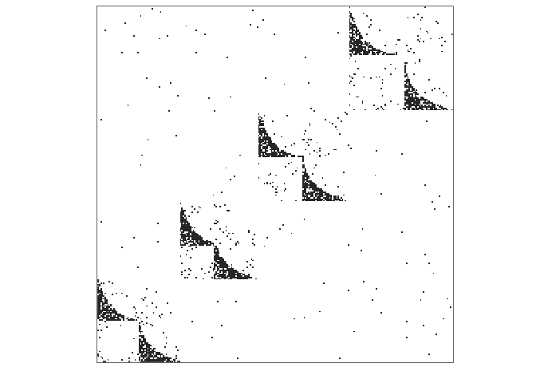
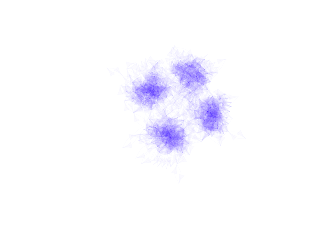

[](https://travis-ci.org/cboettig/NetGen)
[](https://codecov.io/github/cboettig/NetGen?branch=master)
[](https://cran.r-project.org/package=NetGen)
[](https://www.tidyverse.org/lifecycle/#experimental)

<!-- README.md is generated from README.Rmd. Please edit that file -->

# NetGen

## Installation

You can install NetGen from github with:

``` r
# install.packages("devtools")
devtools::install_github("cboettig/NetGen")
```

## Example

This is a basic example which generates a network. See `?netgen` for
documentation describing the parameter arguments.

``` r
library(NetGen)
network <- netgen(n_modav = c(500, 10), 
                  cutoffs = c(50, 10), 
                  net_type = 3, 
                  net_degree = 10,
                  net_rewire = c(0.07,0.2),
                  mod_probs = c(0.2, 0.0, 0.3, 0.3, 0.2, 0.0, 0.0))
```

We can plot the resulting `igraph` as an adjacency matrix:

``` r
adj_plot(network)
```

<!-- -->

Network `igraph` objects can also be plotted using the standard `igraph`
plotting routines, for example:

``` r
plot(network, vertex.size= 0, vertex.label=NA, 
     edge.color = rgb(.1,0,1,.05), vertex.shape="none", 
     edge.curved =TRUE)
```

<!-- -->
